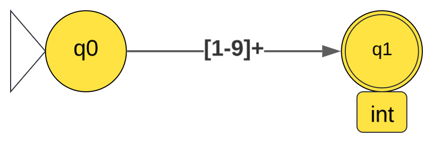
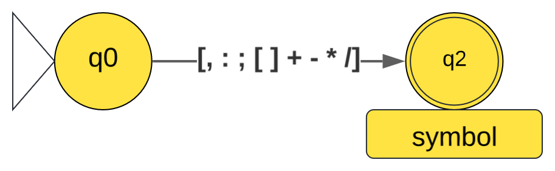
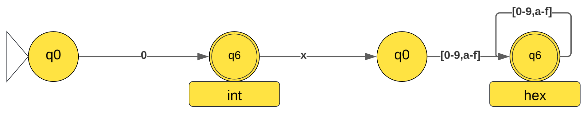
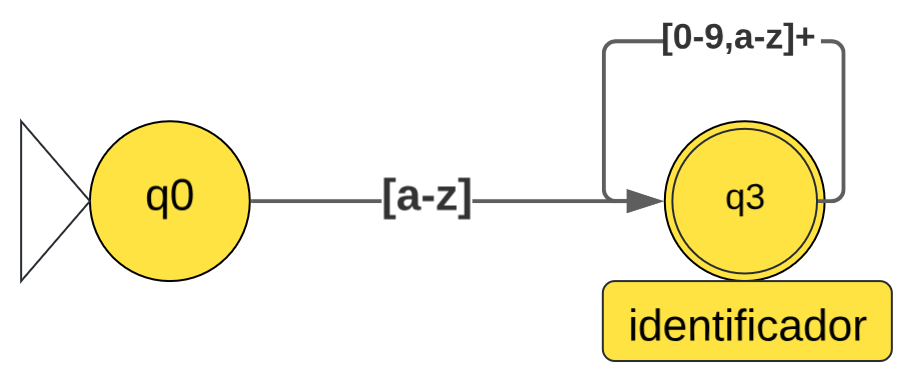
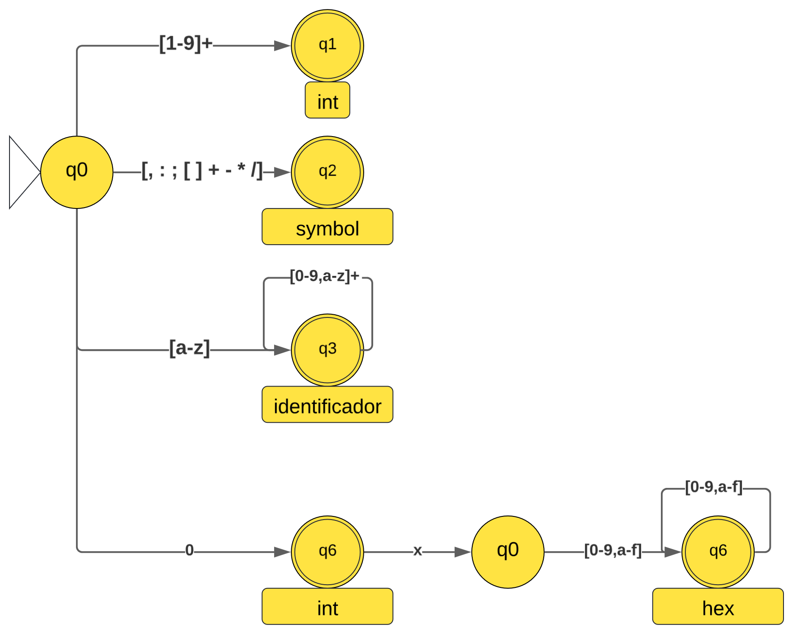

# 🖥️ Compilador Assembly Didático

> Compilador didático que traduz uma linguagem Assembly simples para código de máquina.

---

## 📋 Sumário

- [1. Especificação da Linguagem Fonte](#1-especificação-da-linguagem-fonte)
- [2. Linguagens Regulares](#2-linguagens-regulares)
  - [2.1 Alfabeto](#21-alfabeto)
  - [2.2 Tokens e Expressões Regulares](#22-tokens-e-expressões-regulares)
  - [2.3 Autômato Finito Determinístico](#23-autômato-finito-determinístico)
  - [2.4 Gramática Regular](#24-gramática-regular)
- [3. Linguagens Livres de Contexto](#3-linguagens-livres-de-contexto)
  - [3.1 Gramática Livre de Contexto](#31-gramática-livre-de-contexto)
- [4. Status do Projeto](#4-status-do-projeto)
- [5. Tecnologias](#5-tecnologias)
- [6. Estrutura do Repositório](#6-estrutura-do-repositório)
- [7. Licença](#7-licença)

---

## 1. Especificação da Linguagem Fonte

### 1.1 Visão Geral

A linguagem Assembly Didática possui um conjunto reduzido de instruções, quatro registradores e suporte a labels, comentários e operandos imediatos.

### 1.2 Registradores

| Registrador | Descrição |
| :---------: | --------- |
| `a` | Registrador de propósito geral |
| `b` | Registrador de propósito geral |
| `c` | Registrador de propósito geral |
| `d` | Registrador de propósito geral |

### 1.3 Conjunto de Instruções

| Mnemônico | Operandos | Descrição | Exemplo |
| :-------: | :-------: | --------- | ------- |
| `mov` | `reg, valor` | Move um valor para um registrador | `mov a, 10` |
| `add` | `reg, reg` | Soma dois registradores | `add a, b` |
| `sub` | `reg, reg` | Subtrai dois registradores | `sub a, b` |
| `mul` | `reg, reg` | Multiplica dois registradores | `mul a, b` |
| `div` | `reg, reg` | Divide dois registradores | `div a, b` |
| `cmp` | `reg, valor` | Compara registrador com valor | `cmp a, 10` |
| `jmp` | `label` | Salto incondicional | `jmp loop` |
| `je` | `label` | Salta se igual (ZF = 1) | `je fim` |
| `jne` | `label` | Salta se diferente (ZF = 0) | `jne loop` |
| `jg` | `label` | Salta se maior (SF = OF, ZF = 0) | `jg maior` |
| `jl` | `label` | Salta se menor (SF ≠ OF) | `jl menor` |
| `load` | `reg, [valor]` | Carrega da memória para o registrador | `load a, [100]` |
| `store` | `[valor], reg` | Armazena o registrador na memória | `store [100], a` |
| `hlt` | — | Encerra a execução do programa | `hlt` |

### 1.4 Tipos de Operandos

| Tipo | Formato | Exemplos |
| ---- | ------- | -------- |
| Registrador | `a | b | c | d` | `a`, `b` |
| Imediato decimal | `[0-9]+` | `10`, `255` |
| Imediato hexadecimal | `0x[0-9a-f]+` | `0xFF`, `0x1A` |
| Label | `[a-z][a-z0-9]*` | `main`, `loop1` |
| Endereço de memória | `[valor]` | `[100]`, `[a]` |

### 1.5 Sintaxe do Programa

- Um comando por linha.
- Labels terminam com `:` e ficam em linha própria.
- Comentários iniciam com `;`.
- Instruções seguem o formato: `MNEMÔNICO [operando1[, operando2]]`.

### 1.6 Exemplo de Programa Válido

```asm
; Programa que soma dois números e verifica o resultado
main:
    mov a, 10          ; a = 10
    mov b, 20          ; b = 20
    add a, b           ; a = a + b (30)
    cmp a, 30          ; compara a com 30
    je igual           ; se igual, pula para "igual"
    mov c, 0           ; senão, c = 0
    hlt                ; termina
igual:
    mov c, 1           ; c = 1
    hlt                ; termina
```

---

## 2. Linguagens Regulares

### 2.1 Alfabeto

```text
Σ = {
  a, b, c, d, e, f, g, h, i, j, k, l, m, n, o, p, q, r, s, t, u, v, w, x, y, z,
  0, 1, 2, 3, 4, 5, 6, 7, 8, 9,
  [, ], ,, :, ;, +, -, *, /,
  espaço, tabulação, quebra de linha
}
```

### 2.2 Tokens e Expressões Regulares

| Categoria | Token | Expressão Regular | Exemplos |
| :-------: | :---: | :---------------: | -------- |
| **Símbolos** | `VIRGULA` | `,` | `,` |
|  | `DOIS_PONTOS` | `:` | `:` |
|  | `PONTO_VIRGULA` | `;` | `;` |
|  | `ABRE_COL` | `[` | `[` |
|  | `FECHA_COL` | `]` | `]` |
|  | `OP_SOMA` | `+` | `+` |
|  | `OP_SUB` | `-` | `-` |
|  | `OP_MULT` | `*` | `*` |
|  | `OP_DIV` | `/` | `/` |
| **Números** | `NUM` | `[0-9]+` | `10`, `255` |
|  | `NUM_HEX` | `0x[0-9a-f]+` | `0xFF`, `0x1a` |
| **Identificadores** | `REG` | `[a-d]` | `a`, `b`, `c`, `d` |
|  | `ID` | `[a-z][a-z0-9]*` | `main`, `loop1` |
| **Palavras reservadas** | `MNEMONIC` | `mov|add|sub|mul|div|cmp|jmp|je|jne|jg|jl|load|store|hlt` | `mov`, `hlt` |

### 2.3 Autômato Finito Determinístico


#### inteiros



#### simbolos


#### Hexadecimais



#### Indetificadores



#### Unificado



#### Tabela de Transições

| Estado | Tipo | Transições |
| :----: | :--: | ---------- |
| `q0` | Inicial | `1-9 → q1` · `0 → q6` · `a-z → q3` · `,;:[]+-*/ → q2` |
| `q1` | Final (int) | `0-9 → q1` |
| `q2` | Final (symbol) | — |
| `q3` | Final (ident) | `a-z,0-9 → q3` |
| `q4` | Final (hex) | `0-9,a-f → q4` |
| `q5` | Intermediário | `0-9,a-f → q4` |
| `q6` | Final (int) | `0-9 → q1` · `x → q5` |

#### Estados Finais e Tokens Reconhecidos

| Estado Final | Token |
| :----------: | :---: |
| `q1` | `NUM` |
| `q2` | Símbolo específico |
| `q3` | `ID` / `REG` / `MNEMONIC` |
| `q4` | `NUM_HEX` |
| `q6` | `NUM` (zero) |

### 2.4 Gramática Regular

```text
G = ({S, A, B, C, D, E, F}, Σ, P, S)

onde Σ = {0-9, a-z, x, ,, :, ;, [, ], +, -, *, /}

Produções (P):

; ── Números Inteiros ──
S → 1 | 2 | 3 | 4 | 5 | 6 | 7 | 8 | 9
S → 1A | 2A | 3A | 4A | 5A | 6A | 7A | 8A | 9A
S → 0B

A → 0 | 1 | 2 | 3 | 4 | 5 | 6 | 7 | 8 | 9
A → 0A | 1A | 2A | 3A | 4A | 5A | 6A | 7A | 8A | 9A

B → ε
B → 0A | 1A | 2A | 3A | 4A | 5A | 6A | 7A | 8A | 9A
B → xC

; ── Números Hexadecimais ──
C → 0D | 1D | 2D | 3D | 4D | 5D | 6D | 7D | 8D | 9D
C → aD | bD | cD | dD | eD | fD

D → ε
D → 0D | 1D | 2D | 3D | 4D | 5D | 6D | 7D | 8D | 9D
D → aD | bD | cD | dD | eD | fD

; ── Identificadores ──
S → aE | bE | cE | dE | eE | fE | gE | hE | iE | jE
S → kE | lE | mE | nE | oE | pE | qE | rE | sE | tE
S → uE | vE | wE | xE | yE | zE

E → ε
E → aE | bE | cE | dE | eE | fE | gE | hE | iE | jE
E → kE | lE | mE | nE | oE | pE | qE | rE | sE | tE
E → uE | vE | wE | xE | yE | zE
E → 0E | 1E | 2E | 3E | 4E | 5E | 6E | 7E | 8E | 9E

; ── Símbolos ──
S → ,F | :F | ;F | [F | ]F | +F | -F | *F | /F
F → ε
```

---

## 3. Linguagens Livres de Contexto

### 3.1 Gramática Livre de Contexto

```text
G = ({PROG, LINHAS, LINHA, INSTR, LABEL, COMENT, REG, VALOR, NUM, ID}, Σ', P', PROG)

onde Σ' = {mov, add, sub, mul, div, cmp, jmp, je, jne, jg, jl, load, store, hlt,
           a, b, c, d, 0-9, a-z, [, ], ,, :, ;}
```

#### Produções (P')

```text
; ── Estrutura do Programa ──
<PROG>    → <LINHAS>

<LINHAS>  → <LINHA>
          | <LINHA> <LINHAS>

<LINHA>   → <INSTR>
          | <LABEL>
          | <COMENT>

; ── Labels e Comentários ──
<LABEL>   → <ID> :

<COMENT>  → ; <TEXTO>

; ── Instruções ──
<INSTR>   → mov <REG> , <VALOR>
          | add <REG> , <REG>
          | sub <REG> , <REG>
          | mul <REG> , <REG>
          | div <REG> , <REG>
          | cmp <REG> , <VALOR>
          | jmp <ID>
          | je  <ID>
          | jne <ID>
          | jg  <ID>
          | jl  <ID>
          | load <REG> , [ <VALOR> ]
          | store [ <VALOR> ] , <REG>
          | hlt

; ── Componentes Básicos ──
<REG>     → a | b | c | d

<VALOR>   → <NUM>
          | <REG>

<NUM>     → <DIGITO>
          | <DIGITO> <NUM>

<ID>      → <LETRA>
          | <LETRA> <ID>
          | <ID> <DIGITO>

<LETRA>   → a | b | c | d | e | f | g | h | i | j | k | l | m
          | n | o | p | q | r | s | t | u | v | w | x | y | z

<DIGITO>  → 0 | 1 | 2 | 3 | 4 | 5 | 6 | 7 | 8 | 9

<TEXTO>   → ε
          | <CARACTERE> <TEXTO>
```

---

## 4. Status do Projeto

| Etapa | Status |
| :--- | :---: |
| Especificação da Linguagem | ✅ Concluído |
| Expressões Regulares (ER) | ✅ Concluído |
| Autômato Finito Determinístico (AFD) | ✅ Concluído |
| Gramática Regular (GR) | ✅ Concluído |
| Gramática Livre de Contexto (GLC) | 🔄 Em andamento |
| Autômato com Pilha (AP) | ⏳ Pendente |
| Analisador Léxico | ⏳ Pendente |
| Analisador Sintático | ⏳ Pendente |
| Analisador Semântico | ⏳ Pendente |
| Gerador de Código | ⏳ Pendente |
| Testes e Validação | ⏳ Pendente |

---

## 5. Tecnologias

- Linguagem de implementação: C
- Ferramenta de modelagem: jflap
- Assembly alvo: código de máquina simplificado

---

## 6. Estrutura do Repositório

```text
/
├── docs/
│   └── especificacao.md        # Este documento
├── src/
│   ├── lexico/                 # Analisador léxico
│   ├── sintatico/              # Analisador sintático
│   ├── semantico/              # Analisador semântico
│   └── gerador/                # Gerador de código
├── exemplos/
│   └── *.asm                   # Programas de teste
├── jflap/
│   ├── afd.jff                 # AFD no jflap
│   └── glc.jff                 # GLC no jflap
└── README.md
```

---

## 7. Licença

Este projeto é parte de um trabalho acadêmico da disciplina de Compiladores.

---

> Última atualização: Junho/Julho 2026
`